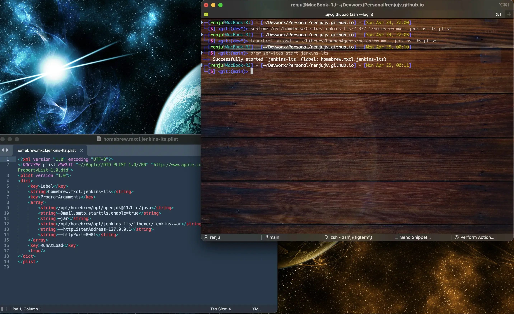
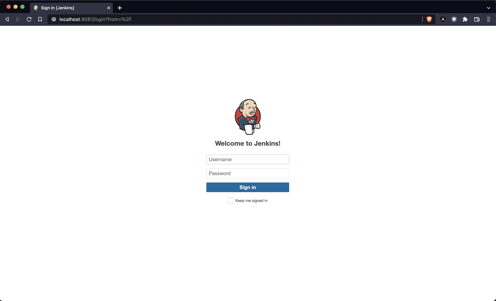

A quick Google search pointed me to the below answer on StackOverflow - https://stackoverflow.com/a/51945048/5132408

However, that didn't work for me. What mentioned there pertained to old Homebrew installation setup. As in my case, for Apple M1 chip based machines, the Homebrew installation folder have changed from `usr/local` to `/opt/homebrew`

Here's what worked for me. If you are looking for regular Jenkins installation without brew, check the last section.



## Jenkins installation via Homebrew:

### 1. Change the port in Jenkins configuration
If you installed Jenkins using Homebrew(recommended) like I did, the below plist file contains the cli arguments used while starting jenkins. You can just change the port number from 8080(default) to any free port, say 8081

`nano /opt/homebrew/Cellar/jenkins-lts/<your_jenkins_version>/homebrew.mxcl.jenkins-lts.plist`

> Note: I have created an alias for sublime text and use sublime almost always when I need to use a text editor.Therefore, you will see `sublime` instead of `nano` in the screenshot

### 2. Unload the existing Jenkins LaunchAgent
We are doing this to update the MacOS LaunchAgent for Jenkins with new configuration.

If we skip this current step, Jenkins will still use existing configuration from the existing LaunchAgent and won't take the update we did in Step 1.

`launchctl unload -w ~/Library/LaunchAgents/homebrew.mxcl.jenkins-lts.plist`

The update will happen while starting Jenkins using the command in next Step 3. 

### 3. Start Jenkins
While unloading Jenkins in step 2, the service will stop automatically. Now, we can start the service using below command and this will update port configuration to the LaunchAgent file as well.
`brew services start jenkins-lts`

Try going to the localhost:8081 port and you can see Jenkins loading up.



---
## Other installation methods
If you installed Jenkins using other methods like the pkg installer, the below commands should work. Haven't tried it myself. You might need to check the documentation of installer you used.
```
sudo defaults write /Library/Preferences/org.jenkins-ci.plist httpPort 9999
sudo launchctl unload /Library/LaunchDaemons/org.jenkins-ci.plist
sudo launchctl load /Library/LaunchDaemons/org.jenkins-ci.plist
```